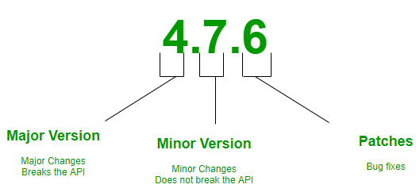
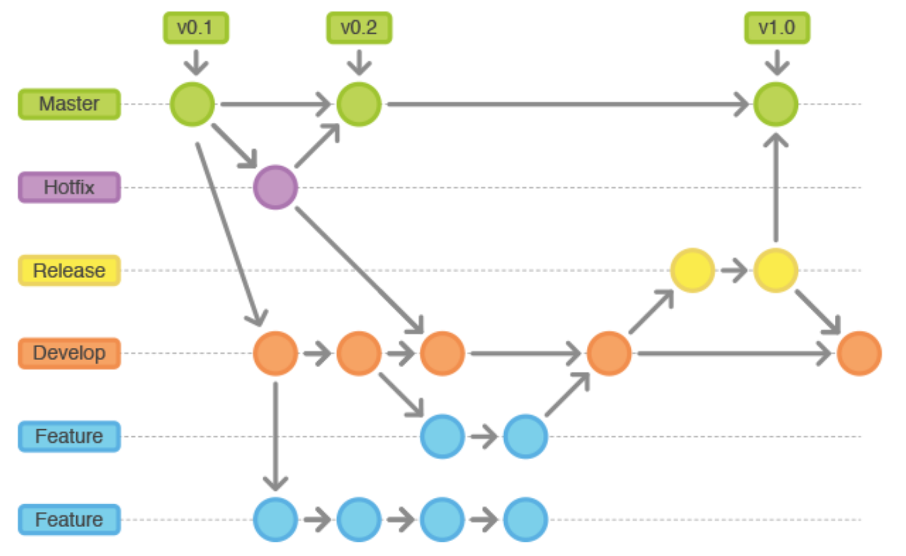

# iblrig

This repository is using [semantic versioning](https://semver.org/) and [gitflow](https://www.atlassian.com/git/tutorials/comparing-workflows/gitflow-workflow) conventions:



Please review these conventions to more easily contribute to the project.

---
## How to work with this repository
### New feature branches:
- `new_feature` branches are forked from the current `develop` branch
- the `new_feature` branches are then merged back into the `develop` branch
- the `new_feature` branch will eventually be deleted

### Release candidate branches:
- a release candidate, `rc` branch is a "pre-release" branch for beta testers on production rigs
- the `rc` branch is forked from the `develop` branch
- once the `rc` has been thoroughly tested, it will be merged into `master` and `develop`
- the `rc` branch will eventually be deleted

### Hotfix branches:
- a `hotfix` or `maintenance` branch is forked from `master`
- once the fix has been thoroughly tested, it will get merged back into `master` and `develop`
- the `hotfix` branch will eventually be deleted

---
## Installation of this software suite on Windows
### Prerequisite Software:
In order to install iblrig on a Windows machine please ensure that the following prerequisite software is first installed:
- [Anaconda](https://anaconda.com)

### Instructions for installation from scratch:
The following commands should be run in the Anaconda Powershell Prompt:
```powershell
conda create --name iblrig python==3.7.13 --yes
conda activate iblrig
conda install git --yes
cd \
git clone https://github.com/int-brain-lab/iblrig
cd C:\iblrig
pip install --editable .
mkdir C:\iblrig_params
python setup_pybpod.py C:\iblrig_params
cd C:\iblrig\Bonsai
setup.bat
cd C:\iblrig
conda create --name ibllib python=3.8.13 --yes
conda activate ibllib
pip install ibllib
python -c "from one.api import ONE; ONE()"  # several prompts will require interaction to configure ONE
conda activate iblrig
pybpod.bat
```

### Instructions for manual update from 6.6.x to 6.6.4:
The following commands to be run from the Anaconda Powershell Prompt. Please ensure that your git and
  anaconda environment are up-to-date. **Backup any custom tasks or modifications before performing the following**
```powershell
conda activate iblrig
cd C:\iblrig
git reset —-hard
git fetch
git pull  
```

### Running pybpod
- Navigate your Anaconda Prompt to the iblrig folder: `cd C:\iblrig`
- Ensure the `iblrig` anaconda environment is activated: `conda activate iblrig`
- At the prompt, run: `.\pybpod.bat`
