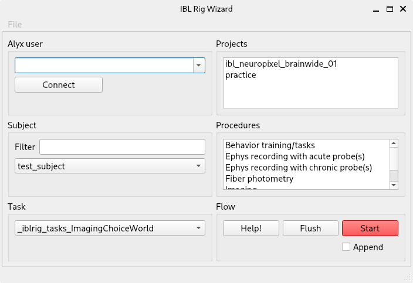

************
Using IBLRIG
************

IBLRIG v8 provides users with two distinct interfaces: a command line interface (CLI) and a graphical user interface (GUI).
The CLI encompasses the complete functionality of IBLRIG, upon which the GUI is constructed to enhance user-friendliness.
All tasks achievable through the GUI are equally achievable through the CLI.

The Graphical User Interface
============================

To initiate a task through the graphical user interface, open a Windows PowerShell and enter:

.. code:: powershell

   C:\iblrigv8\venv\scripts\Activate.ps1
   iblrig

These commands activate the necessary environment and launch the IBL
Rig Wizard GUI window, as shown below:

   A screenshot of IBL Rig Wizard

Starting a Task
---------------

1. Enter your Alyx username, then click on the *Connect* button. This
   action will automatically populate the GUI fields with information
   pertinent to your lab.

2. Select the desired values from the provided options. Utilize the
   *Filter* field to swiftly narrow down the list of displayed subjects.
   Note that selections for *Project* and *Procedure* are mandatory.

3. Click the *Start* button to initiate the task.

Supplementary Controls
----------------------

-  If you check the *Append* option before clicking *Start*, the task
   you initiate will be linked to the preceding task, creating a
   sequence of connected tasks.

-  The *Flush* button serves to toggle the valve for cleaning purposes.

.. note::
   IBLRIG's Graphical User Interface is still work-in-progress. If you have any suggestions to make the GUI
   more usable, please add an `issue on GitHub <https://github.com/int-brain-lab/iblrig/issues>`_ or approach the dev-team on Slack!
   We are happy to discuss possible changes with you!

The Command Line Interface
==========================

To use the command line interface, open a terminal and activate the
environment:

.. code:: powershell

   cd C:\iblrigv8\
   venv\scripts\Activate.ps1

Running a single task
---------------------

To run a single task, execute the following command:

.. code:: powershell

   python .\iblrig_tasks\_iblrig_tasks_trainingChoiceWorld\task.py --subject algernon --user john.doe

Chaining several tasks together
-------------------------------

To chain several tasks together, use the ``--append`` flag. For
instance, to run a passive task after an ephys task:

1. Run the ephys task

   .. code:: powershell

      .\iblrig_tasks\_iblrig_tasks_ephysChoiceWorld\task.py --subject algernon

2. Run the passive task with the ``--append``\ flag:

   .. code:: powershell

      .\iblrig_tasks\_iblrig_tasks_passiveChoiceWorld\task.py --subject algernon --append

Flushing the valve
------------------

To flush valve 1 of the Bpod, type ``flush`` and confirm with ENTER. Press ENTER again to close the valve.

Copy commands
=============

Usage
-----

To initiate the data transfer from the local server to the remote
server, open a terminal and type.

.. code:: powershell

   C:\iblrigv8\venv\scripts\Activate.ps1
   transfer_data

The transfer local and remote directories are set in the
``iblrig/settings/iblrig_settings.py`` file.

Clean-up local data
-------------------

To remove sessions fully copied to the server and older than 2 weeks,
open a terminal and type:

.. code:: powershell

   C:\iblrigv8\venv\scripts\Activate.ps1
   remove-old-sessions

Note: the server needs to be up and running or the sessions won’t be
verified as copied.

Installation
------------

If you get missing libraries, you can install the iblscripts package
with

.. code:: powershell

   pip install git+https://github.com/int-brain-lab/iblscripts.git

FAQ
===

TODO: Section with common copy errors and how to fix them

Behind the Copy Scripts
-----------------------

Workflow
~~~~~~~~

1. **Initial Stub Creation:** At the start of acquisition, an incomplete
   experiment description file - a *‘stub’* - is saved to the session
   on, both, the local PC and the lab server in a subfolder called
   ``_devices``. The filename of the stub includes the PC’s identifier,
   allowing the copy script to identify its source.

2. **Executing the Copy Script:** The copy script is executed on each
   acquisition PC independently and in no particular order.

3. **Navigating Local Session Data:** The script systematically
   navigates through local session folders (or optionally a separate
   ``transfers`` folder) that contain ``experiment.description`` stubs.

4. **Skipping Transferred Sessions:** The script ignores session folders
   containing a file named ``transferred.flag`` (see 7).

5. **Copying Collections:** For each session, the script reads the
   respective stub and uses ``rsync`` to copy each ``collection``.
   Subfolders not specified under a ``collection`` key are omitted from
   copying.

6. **Removing Remote Stubs:** Upon successful copying, the remote stub
   file is merged with the remote ``experiment.description`` file (or
   copied over if one doesn’t exist already). The remote stub file is
   then deleted.

7. **Confirming Transfer Locally:** A ``transferred.flag`` file is
   created in the local session folder to confirm the transfer’s
   success.

8. **Completion and Cleanup:** Once no more remote stub files exist
   for a given session, the empty ``_devices`` subfolder is removed.
   Additionally, a ‘raw_session.flag’ file is created in the remote session folder,
   indicating the successful transfer of all files.

Example of workflow
~~~~~~~~~~~~~~~~~~~

Example of three sessions each in a different copy state:

* The State on the Remote Lab Server
  ::

     lab server/
     └── subject/
         └── 2020-01-01/
             ├── 001/
             │   └── _devices/
             │       ├── 2020-01-01_1_subject@taskPC.yaml
             │       └── 2020-01-01_1_subject@ephysPC.yaml
             ├── 002/
             │   ├── _ibl_experiment.description.yaml
             │   ├── raw_task_data_00/
             │   └── _devices/
             │       └── 2020-01-01_1_subject@ephysPC.yaml
             └── 003/
                 ├── raw_task_data_00/
                 ├── raw_ephys_data/
                 ├── _ibl_experiment.description.yaml
                 └── raw_session.flag

* The State on the Local Task Acquisition PC
  ::

     acquisition computer (taskPC)/
     └── subject/
         └── 2020-01-01/
             ├── 001/
             │   ├── raw_task_data_00/
             │   └── _ibl_experiment.description_taskPC.yaml
             ├── 002/
             │   ├── raw_task_data_00/
             │   ├── _ibl_experiment.description_taskPC.yaml
             │   └── transferred.flag
             └── 003/
                 ├── raw_task_data_00/
                 ├── folder_not_in_desc_file/
                 ├── _ibl_experiment.description_taskPC.yaml
                 └── transferred.flag

* The State on the Local Ephys Acquisition PC
   ::

     acquisition computer (ephysPC)/
     └── subject/
         └── 2020-01-01/
             ├── 001/
             │   ├── raw_ephys_data/
             │   └── _ibl_experiment.description_ephysPC.yaml
             ├── 002/
             │   ├── raw_ephys_data/
             │   ├── _ibl_experiment.description_ephysPC.yaml
             └── 003/
                 ├── raw_ephys_data/
                 ├── folder_not_in_desc_file/
                 ├── _ibl_experiment.description_ephysPC.yaml
                 └── transferred.flag

With the lab server and acquisition pcs in the states above, the
sessions are in the following states

* ``subject/2020-01-01/001`` no data have been copied.
* ``subject/2020-01-01/002`` data from *taskPC* have been copied, data from *ephysPC* remains to be copied.
* ``subject/2020-01-01/003`` data copied from all acquisition PCs.
