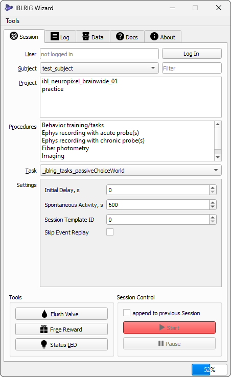
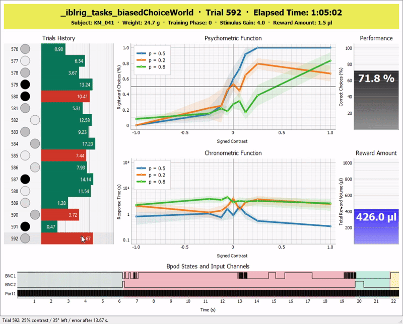

Running a behaviour experiment
==============================

IBLRIG v8 provides users with two distinct interfaces: a command line interface (CLI) and a graphical user interface (GUI).
The CLI encompasses the complete functionality of IBLRIG, upon which the GUI is constructed to enhance user-friendliness.
All tasks achievable through the GUI are equally achievable through the CLI.

The Graphical User Interface
----------------------------

To initiate a task through the graphical user interface, open a Windows PowerShell and enter:

.. code:: powershell

   C:\iblrigv8\venv\scripts\Activate.ps1
   iblrig

These commands activate the necessary environment and launch the IBLRIG Wizard GUI as shown below:

   A screenshot of IBLRIG Wizard

Starting a Task
~~~~~~~~~~~~~~~

1. Enter your Alyx username, then click on the *Connect* button. This
   action will automatically populate the GUI fields with information
   pertinent to your lab.

2. Select the desired values from the provided options. Utilize the
   *Filter* field to swiftly narrow down the list of displayed subjects.
   Note that selections for *Project* and *Procedure* are mandatory.

3. Click the *Start* button to initiate the task.

Supplementary Controls
~~~~~~~~~~~~~~~~~~~~~~

-  When starting a subsequent task with the same subject, you'll be asked if
   you want to append to the preceding session. Doing so will result in a
   sequence of connected tasks sharing the same data folder.

-  The *Flush* button serves to toggle the valve for cleaning purposes.

.. note::
   IBLRIG's Graphical User Interface is still work-in-progress. If you have any suggestions to make the GUI
   more usable, please add an `issue on GitHub <https://github.com/int-brain-lab/iblrig/issues>`_ or approach the dev-team on Slack!
   We are happy to discuss possible changes with you!

Online Plots
~~~~~~~~~~~~

Tasks that inherit from :class:`~iblrig.base_choice_world.ActiveChoiceWorldSession` will display interactive online plots during an ongoing session.
These plots are designed to provide real-time feedback during the task, allowing users to visualize key metrics and performance indicators as the experiment progresses.

   Interactive Online Plots

Subpanels
^^^^^^^^^

The online plots consist of the following subpanels:

Trials History:
   Indicates the stimulus position and contrast level, debiasing trials, reaction times and the outcome of each trial.
   Hovering the mouse over a trial row will display these details in the window's status bar.
   Selecting a trial row by mouse or keyboard (up/down arrows) will show the respective trial's Bpod states and events (see below).

Psychometric Function:
   Displays the psychometric function based on the current session's data.
   The x-axis represents the stimulus contrast, while the y-axis shows the proportion of correct responses.

Chronometric Function:
   Shows the chronometric function, which plots reaction times against stimulus contrast.
   This function helps to analyze how reaction times vary with different levels of stimulus difficulty.
   The x-axis represents the stimulus contrast, while the y-axis shows the reaction time (log scale).

Performance:
   The performance plot displays the percentage of correct responses across all trials.

Reward Amount:
   The amount of water delivered during the session.

Bpod States and Events:
   Indicates a trial's Bpod states (background colors) and input channels (line plots).
   Hover the mouse over a state to see the respective state name in the window's status bar.
   Use the mouse wheel to zoom in and out, and click and drag to pan the plot.

Engagement Criteria / Color-Code
^^^^^^^^^^^^^^^^^^^^^^^^^^^^^^^^

From 45 minutes after the start of a session, the online plots will indicate engagement criteria by changing the background color of the header area.
The color-coding is as follows:

Red:
   The subject has been training for more than 90 minutes.

Green:
   The subject failed to complete more than 400 trials in the first 45 mins.

Yellow:
   The subject's reaction time over the last 20 trials is more than 5 times greater than the overall reaction time.

Displaying Past Sessions
^^^^^^^^^^^^^^^^^^^^^^^^

Online plots of past sessions can be opened with the ``view_session`` command:

*  by indicating the path to a session's ``raw_task_data`` folder:

   .. code:: powershell

      C:\iblrigv8\venv\scripts\Activate.ps1
      view_session C:\iblrigv8_data\Subjects\KS022\2019-12-10\001\raw_task_data

*  by indicating the path to a session's ``_iblrig_taskData.raw.jsonable`` file:

   .. code:: powershell

      C:\iblrigv8\venv\scripts\Activate.ps1
      view_session C:\iblrigv8_data\Subjects\KS022\2019-12-10\001\raw_task_data\_iblrig_taskData.raw.jsonable

*  by indicating a session's `EID <https://int-brain-lab.github.io/ONE/one_reference.html#experiment-ids>`_ once it's uploaded to Alyx:

   .. code:: powershell

      C:\iblrigv8\venv\scripts\Activate.ps1
      view_session 3150c751-d5ae-43de-a908-56481b16f821

Interfacing with Alyx
---------------------

Although this is not mandatory, the IBLRIG GUI is designed to interface with `Alyx <https://github.com/cortex-lab/alyx>`_, the International Brain Laboratory's database.
This feature allows users to access their subjects and projects directly from the GUI, without the need to manually enter this information.

To enable this feature, you must have an Alyx account and have configured your database URL and credentials as mentioned  :doc:`installation`.

- The *subjects* available are the set of alyx subjects that are alive, not stock, and belong to the lab defined in the `iblrig_settings.py` file.
- The *projects* available are the set of projects of which the current user is a participant. Login to Alyx > Subjects > Projects to check your projects.

The Command Line Interface
--------------------------

To use the command line interface, open a terminal and activate the
environment:

.. code:: powershell

   cd C:\iblrigv8\
   venv\scripts\Activate.ps1

Running a single task
~~~~~~~~~~~~~~~~~~~~~

To run a single task, execute the following command:

.. code:: powershell

   python .\iblrig_tasks\_iblrig_tasks_trainingChoiceWorld\task.py --subject algernon --user john.doe

Chaining several tasks together
~~~~~~~~~~~~~~~~~~~~~~~~~~~~~~~

To chain several tasks together, use the ``--append`` flag. For
instance, to run a passive task after an ephys task:

1. Run the ephys task

   .. code:: powershell

      .\iblrig_tasks\_iblrig_tasks_ephysChoiceWorld\task.py --subject algernon

2. Run the passive task with the ``--append``\ flag:

   .. code:: powershell

      .\iblrig_tasks\_iblrig_tasks_passiveChoiceWorld\task.py --subject algernon --append

Flushing the valve
~~~~~~~~~~~~~~~~~~

To flush valve 1 of the Bpod, type ``flush`` and confirm with ENTER. Press ENTER again to close the valve.
