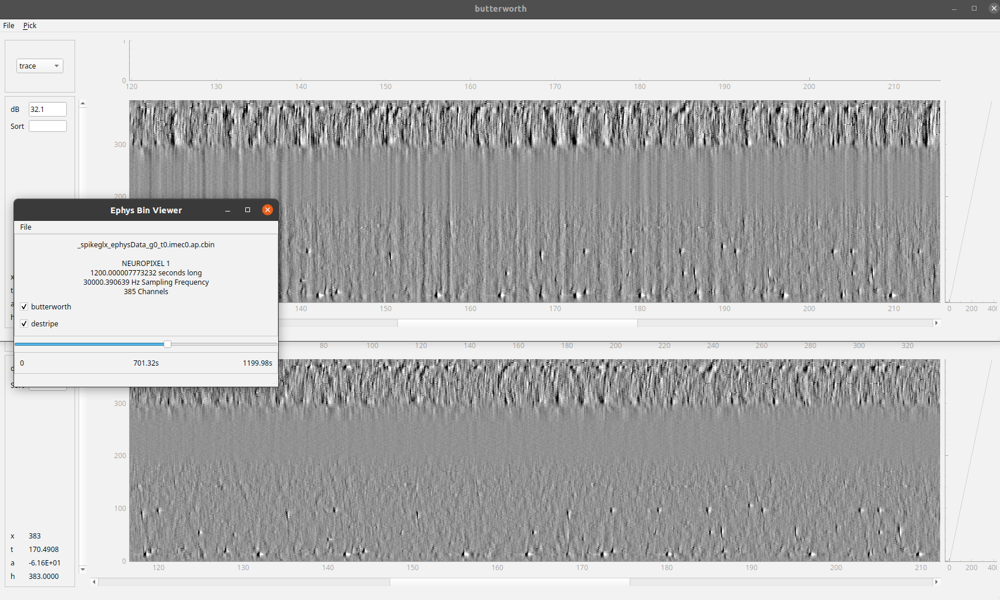

Neurophotometrics recording with iblrigv8
=========================================

This document describes how to use the iblrigv8 software to record Photometry using Neurophotometrics FP3002 system.

Setup
-----

Just make sure iblrigv8 is installed according to the instructions and that the iblrig_settings.py
file is configured with the local folder and remote folder for the data transfer.

.. code:: yaml

    device_neurophotometrics:
      BONSAI_WORKFLOW: devices/neurophotometrics/photometry_NP3002.bonsai

Starting a task
---------------

Below shows how to start the electrophysiology for the subject 'example' with 2 probes:

.. code:: powershell

   cd C:\iblrigv8\
   venv\scripts\Activate.ps1
   start_ephys_session example 2

Copy command
------------

Usage
~~~~~

To initiate the data transfer from the local server to the remote server, open a terminal and type.

.. code:: powershell

   C:\iblrigv8\venv\scripts\Activate.ps1
   transfer_data --tag ephys

The transfer local and remote directories are set in the
``iblrig/settings/iblrig_settings.py`` file.

Look at the raw data
--------------------

This will launch the viewephys GUI, you can then use file -> open and navigate
to open the raw data file you wish to display.

.. code:: powershell

   cd C:\iblrigv8\
   venv\scripts\Activate.ps1
   viewephys

More information on the viewephys package can be found at: https://github.com/int-brain-lab/viewephysNeuropixel recording with iblrigv8
==================================

This document describes how to use the iblrigv8 software to record from the Neuropixel computer.

Setup
-----

Just make sure iblrigv8 is installed according to the instructions and that the iblrig_settings.py
file is configured with the local folder and remote folder for the data transfer.

To get access to the viewephys visualizer:

.. code:: powershell

   cd C:\iblrigv8\
   venv\scripts\Activate.ps1
   pip install viewephys

Starting a task
---------------

Below shows how to start the electrophysiology for the subject 'example' with 2 probes:

.. code:: powershell

   cd C:\iblrigv8\
   venv\scripts\Activate.ps1
   start_ephys_session example 2

Copy command
------------

Usage
~~~~~

To initiate the data transfer from the local server to the remote server, open a terminal and type.

.. code:: powershell

   C:\iblrigv8\venv\scripts\Activate.ps1
   transfer_data --tag ephys

The transfer local and remote directories are set in the
``iblrig/settings/iblrig_settings.py`` file.

Look at the raw data
--------------------

This will launch the viewephys GUI, you can then use file -> open and navigate
to open the raw data file you wish to display.

.. code:: powershell

   cd C:\iblrigv8\
   venv\scripts\Activate.ps1
   viewephys

More information on the viewephys package can be found at: https://github.com/int-brain-lab/viewephys