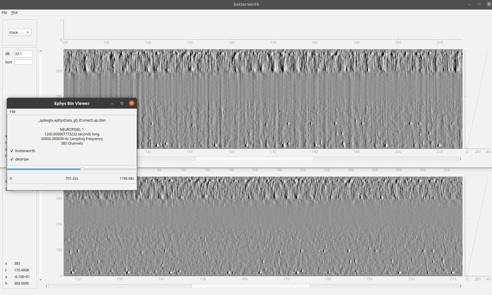

Neuropixel recording with iblrigv8
==================================

This document describes how to use the iblrigv8 software to record from the Neuropixel computer.

Setup
-----

Just make sure iblrigv8 is installed according to the instructions and that the iblrig_settings.py
file is configured with the local folder and remote folder for the data transfer.

To get access to the viewephys visualizer:

.. code:: powershell

   cd C:\iblrigv8\
   venv\scripts\Activate.ps1
   pip install viewephys

Starting a task
---------------

Below shows how to start the electrophysiology for the subject 'example' with 2 probes:

.. code:: powershell

   cd C:\iblrigv8\
   venv\scripts\Activate.ps1
   start_ephys_session example 2

Starting a task with multiple drives
-------------------------------------

When recording with probes spread across multiple drives, first create a YAML configuration file
mapping each drive path to the number of probes recorded on that drive:

.. code:: yaml

   C:\iblrig_data\Subjects: 2
   D:\iblrig_data\Subjects: 2

Probes are assigned to drives in an alternating fashion: with the example above, ``probe00`` and
``probe02`` go to the first drive, ``probe01`` and ``probe03`` to the second.

Then start the session by passing the subject name and the path to that file:

.. code:: powershell

   cd C:\iblrigv8\
   venv\scripts\Activate.ps1
   start_ephys_session_multi_drive example C:\iblrig_data\multi_drive_config.yaml

Copy command
------------

Usage
~~~~~

To initiate the data transfer from the local server to the remote server, open a terminal and type.

.. code:: powershell

   C:\iblrigv8\venv\scripts\Activate.ps1
   transfer_data --tag ephys

When using multiple drives, run the transfer once per drive using the drive index as the tag suffix:

.. code:: powershell

   C:\iblrigv8\venv\scripts\Activate.ps1
   transfer_data --tag ephys_0
   transfer_data --tag ephys_1

The transfer local and remote directories are set in the
``iblrig/settings/iblrig_settings.py`` file.

Look at the raw data
--------------------

This will launch the viewephys GUI, you can then use file -> open and navigate
to open the raw data file you wish to display.

.. code:: powershell

   cd C:\iblrigv8\
   venv\scripts\Activate.ps1
   viewephys

More information on the viewephys package can be found at: https://github.com/int-brain-lab/viewephys